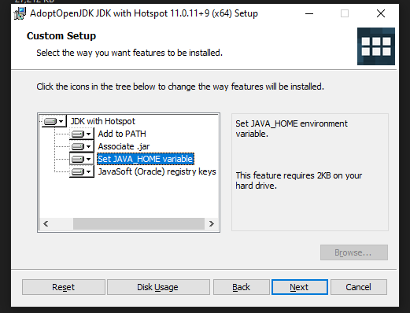
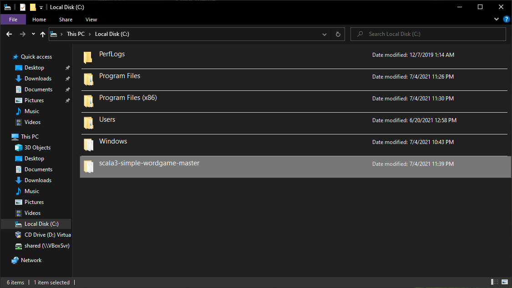

## sbt project compiled with Scala 3

### Usage

This is a normal sbt project. You can compile code with `sbt compile`, run it with `sbt run`, and `sbt console` will start a Scala 3 REPL.

For more information on the sbt-dotty plugin, see the
[scala3-example-project](https://github.com/scala/scala3-example-project/blob/main/README.md).

# Setup and Installation
These are for Windows; Linux and MacOS should be similar/easier.

1. Download and install `AdoptOpenJDK` Version 11 at https://adoptopenjdk.net/ Make sure to choose the options to add it to `PATH` and set `JAVA_HOME`.

  

2. Download and install `JetBrains IntelliJ IDEA` at https://www.jetbrains.com/idea/

  

3. Reboot.

   

4. Download and install `sbt` version 1.5.4 or later (the version is important! It won't work otherwise) at https://www.scala-sbt.org/download.html (you need the `.msi` installer for Windows).

   

5. Launch IntelliJ, to go `Plugins` and install the `Scala` plugin.

    

6. Restart IntelliJ.

   

7. Go to IntelliJ Settings, `Build, Execution and Deployment/Build Tools/sbt` and point it to your `AdoptOpenJDK` and `sbt` installations:

   

8. Download the repository zip file:

   

9. Extract it to `C:\scala3-simple-wordgame-master`.

   

10. In IntelliJ, click "Open" and navigate to the `build.sbt` file:

   

11. Choose "Open as Project":

   

12. Choose to "Trust":

   

13. Now wait for about 5 minutes.

   

14. Eventually it will finish.

   

15. Open "Terminal" and type `sbt`. Then type `compile`.

   

16. Type `test` to run the tests.

   

17. Type `run` to play the game!

   